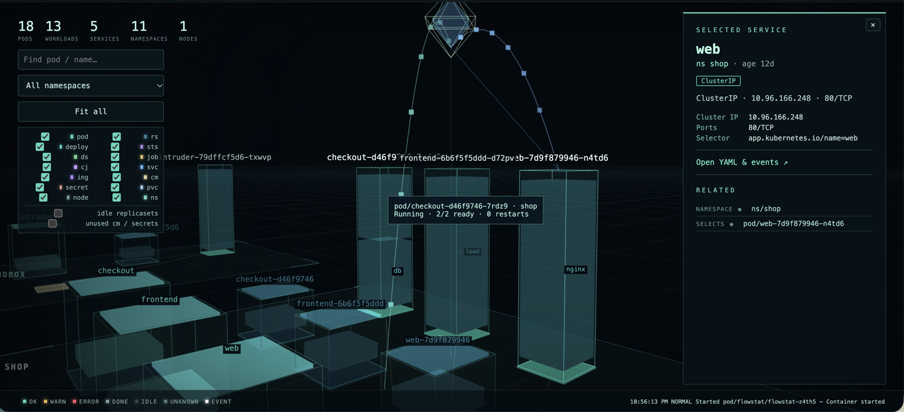

# kubectl skyline

A `kubectl` plugin that renders your cluster as an explorable 3D city in the browser.
Namespaces are floor plates, workloads and pods are glowing towers with one layer per
container, services and ingresses float above the pods they route to, and live events spark
from the objects they touch. Click anything for its relationships, YAML, events and logs.
Read-only, loopback only.



## Install

```sh
curl -fsSL https://raw.githubusercontent.com/zdk/kubectl-skyline/main/install.sh | sh
```

This installs the latest release for macOS or Linux and verifies its checksum.
Set `VERSION=v0.1.4` to pin a release, or `INSTALL_DIR` to choose where it goes.

Or with krew:

```sh
kubectl krew install skyline
```

Not in the krew index yet? Install from the latest release manifest:

```sh
kubectl krew install --manifest-url https://github.com/zdk/kubectl-skyline/releases/latest/download/skyline.yaml
```

Or with Go:

```sh
go install github.com/zdk/kubectl-skyline/cmd/kubectl-skyline@latest
```

## Run

```sh
kubectl skyline              # current context, all namespaces, opens the browser
kubectl skyline -n shop      # one namespace; --context and other kubectl flags work too
```

Drag to orbit, right-drag to pan, scroll to zoom, click to select, `/` to search, `f` to fit all.

## License

MIT. three.js is vendored under its own MIT license.
